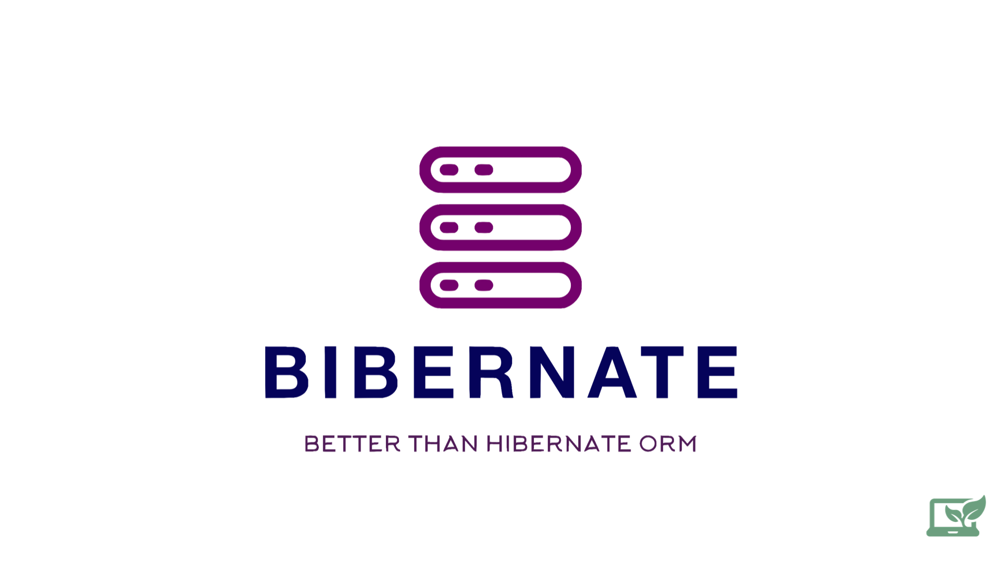

## <span style="color:green">Hoverla Bibernate Framework</span>

Bibernate is a Java Object-Relational Mapping (ORM) framework which can help you work with a database in an object-oriented manner

Implemented features:

1. Datasource's configuration. Under the hood HikariDataSource is used to manage connection pool
2. Custom connection pool called Bibari.
3. First level cache. Managed entities are stored in internal cache 
4. Action Queue. Write operation query will be sent only after flush or close method calls
5. Transaction management. It is possible to merge a few queries together. If anything fails - the rollback is performed. Readonly mode is also supported
6. Dirty checking mechanism. All the managed entities are compared with their own snapshot copy during a flush operation. It is turned of for readonly mode
6. Crud operations

Annotations used by the framework:

1. <span style="color:green">_**@Entity**_</span> - declares the class as an entity (i.e. a persistent POJO class).
2. <span style="color:green">_**@Table**_</span> - it is set at the class level; it allows you to define the table name for your
   entity mapping.
3. <span style="color:green">_**@Id**_</span> - declares the identifier property of this entity
4. <span style="color:green">_**@Column**_</span> - used for a property name mapping. In case if it is not declared explicitly then field name is taken as a
   column name

How to use:
1. Fill in the application.properties file:
```properties
db.url=jdbc:postgresql://localhost:5432/customers
db.username=postgres
db.password=postgres
db.driver=org.postgresql.Driver
db.pool.size=5
# hikari or bibari
db.pool.provider=hikari
```
2. Create an entity like this one:
```java
@ToString
@Setter
@Entity
@Table(name = "customer")
public class Customer {
   @Id
   private Integer id;
   @Column(name = "first_name")
   private String firstName;
   @Column(name = "last_name")
   private String lastName;
   @Column(name = "email")
   private String email;
   @Column(name = "created_at")
   private LocalDateTime createdAt;
}
```

3. Declare some helper methods (optional step):

```java
private static <T> T readInTx(Function<Session, T> sessionFunction) {
  var session = sessionFactory.openSession();
  var transactionManager = session.getTransactionManager();
  try {
     transactionManager.begin();
     T result = sessionFunction.apply(session);
     transactionManager.commit();
     return result;
  } catch (Exception e) {
     transactionManager.rollback();
     throw new TransactionalOperationException("Could not complete transaction", e);
  } finally {
     session.close();
  }
}

private static void doInTx(Consumer<Session> sessionConsumer) {
  readInTx(session -> {
     sessionConsumer.accept(session);
     return null;
  });
}
```
4. Do your work inside transaction for example:
```java
doInTx(session -> {
   Customer customer = session.find(Customer.class, 45L);

   Customer newCustomer = new Customer();
   newCustomer.setFirstName("Anton");
   newCustomer.setLastName("Prudyus");
   newCustomer.setEmail("antonprudyus97424@gmail.com");
   newCustomer.setCreatedAt(LocalDateTime.now());
   session.persist(newCustomer);
   log.info("Found customer: {}, ", customer);
   Customer sameCustomer = session.find(Customer.class, 45L);
   //should be true, 1st level cache
   log.info("customer: {} is equal to customer {} : {} ", customer, sameCustomer, customer == sameCustomer);

   sameCustomer.setFirstName("DIRTY_CHECK_766");
});
```

If you don't open the transaction, every operation is performed using autocommit mode.

Don't hesitate to help us with improving of our project. It's opensource and free to use. We're waiting for your contribution 😜

https://github.com/bobocode-hoverla/Bibernate